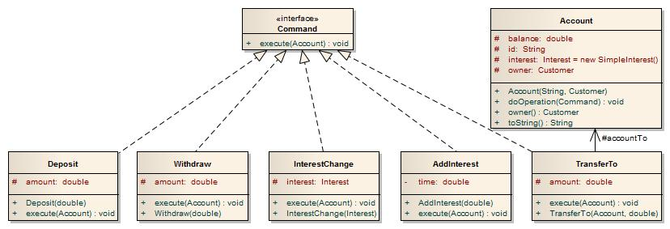

### Command

Zapoznać się z programem symulującym operacje bankowe (Bank.zip). Zrefaktoryzować program do postaci przedstawionej na poniższym diagramie wykorzystując wzorzec Command.

Aby zaimportować archiwum pod NetBeans należy wybrać: File -> Import Project -> From ZIP...