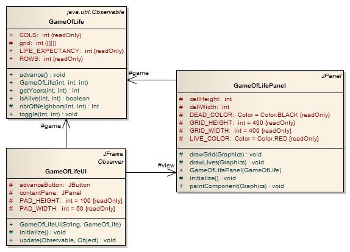

# Lab 1 - GoF

## I. Prototype

Zapoznać się z dotychczasową implementacją wzorca Prototype ([prototype\_OO\_stud.zip](./prototype_OO_stud.zip) lub [Task1-Prototype](./Task1-Prototype)).

Stworzyć interfejs `IPrototype` wyposażony w domyślne implementacje `shallowClone()` oraz `deepClone()` (wykorzystać _default methods_ wprowadzone w Java 8).  

Zmodyfikować klasę `Car` w taki sposób, aby zamiast dziedziczć po klasie `Prototype`, implementowała interfejs `IPrototype`.  

Napisać testy _JUnit_ weryfikujące poprawne działanie metod kopiujących na obiektach `Car`.

### Uruchomienie projektu
#### 1) Opcja: Uruchomienie [Task1-Prototype](./Task1-Prototype) (Maven)
Otwórz IDE (IntelliJ, VSCode, Eclipse) i zaimportuj projekt.

#### 2) Opcja: Uruchomienie [prototype\_OO\_stud.zip](./prototype_OO_stud.zip)
Aby zaimportować archiwum pod Eclipse należy wybrać: `File->Import...->General->Existing Projects into Workspace->Select archive file`.

## II. Observer

Zapoznać się z programem _Game of Life_ ([Game\_of\_Life.zip](./Game_of_Life.zip) lub [Task2-Observer](./Task2-Observer)).

Zrefaktoryzować program do postaci przedstawionej na poniższym diagramie wykorzystując wzorzec Observer. 

### Uruchomienie projektu
#### 1) Opcja: Uruchomienie [Task2-Observer](./Task2-Observer) (Maven)
Otwórz IDE (IntelliJ, VSCode, Eclipse) i zaimportuj projekt.

#### 2) Opcja: Uruchomienie [prototype\_OO\_stud.zip](./prototype_OO_stud.zip)

Stworzenie projektu w IntelliJ:
1. Na ekranie startowym naciśnij Ctrl+Shift+A i wpisz ***source***, następnie wybierz pozycję ***Import Project from Existing Sources...***.
1. Wybierz katalog `nopattern` z rozpakowanego pliku pobranego z GitHuba.
1. Zaakceptuj domyślne ustawinia naciskając klawisz ***Next***, a na końcu ***Create***.
1. Zbuduj projekt, a następnie uruchom aplikację z klasy `Main`.

Aby zaimportować archiwum pod Eclipse należy wybrać: `File->Import...->General->Existing Projects into Workspace->Select archive file`.