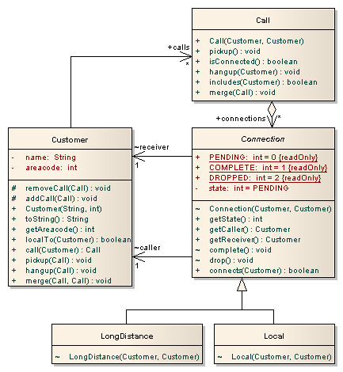
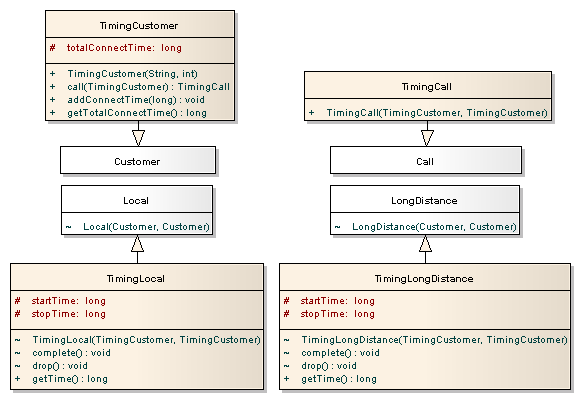
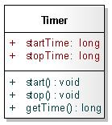

# Lab 3 - Open-closed Principle, AOP 

## Documentation

*   [AspectJ](http://eclipse.org/aspectj/)
*   [Lecture examples](./Lecture_examples)

# Telecom

## Basic version

_Telecom_ ([telecomOO.zip](./telecomOO.zip) or [Task-telecom](./Task-telecom)) is a simple simulation of a telephony system in which customers make, accept, merge and hang-up both local and long distance calls. The structure of Telecom is presented in the figure below as a UML class diagram. The initial version comprises the classes Customer, Call and the abstract class Connection with its two concrete subclasses Local and LongDistance. Customers have a name and a numeric area code. They also have methods for managing calls. Simple calls are made between one customer (the caller) and another (the receiver), a Connection object is used to connect them. Conference calls between more than two customers will involve more than one connection. A customer may be involved in many calls at one time.  

*   `Customer` has methods `call, pickup, hangup` and `merge` for managing calls.
*   `Call` is created with a caller and receiver who are customers. If the caller and receiver have the same area code then the call can be established with a `Local` connection (see below), otherwise a `LongDistance` connection is required. A call comprises a number of connections between customers. Initially there is only the connection between the caller and receiver but additional connections can be added if calls are merged to form conference calls.
*   `Connection` models the physical details of establishing a connection between customers. It does this with a simple state machine (connections are initially `PENDING`, then `COMPLETED` and finally `DROPPED`). Connection is an abstract class with two concrete subclasses: `Local` and `LongDistance`.

## Change scenarios:

*   _Timing concern_ measures the total connection time per customer. It starts a timer when a connection is completed and stops the timer when the connection is dropped. Then, it updates the accumulated connection time for the caller.
    
        
        [...]
        connection from Jim(650) to Crista(415) dropped
        Jim(650) has been connected for 6 seconds
        Crista(415) has been connected for 2 seconds
        Mik(650) has been connected for 4 seconds
        
    
*   _Billing concern_ adds billing functionality to the telecom application on top of timing. charges customers for the calls they make. It calculates a charge per connection and, upon termination of a connection, adds the charge to the appropriate customer's bill. Billing depends on timing and on the type of the connection (`LOCAL_RATE = 3, LONG_DISTANCE_RATE = 10`).
    
        
        [...]
        connection from Jim(650) to Crista(415) dropped
        Jim(650) has been connected for 6 seconds and has a bill of 32
        Crista(415) has been connected for 2 seconds and has a bill of 6
        Mik(650) has been connected for 4 seconds and has a bill of 0
        
    

## Suggested solutions for the Timing change scenario

*   OO version  
    
*   AO version  
    `Timing` aspect declares that each `Connection` object has a timer. A `Timer` object records the current time when it is started and stopped, and returns their difference when asked for the elapsed time. Two after advices ensure that the timer is started when a connection is completed and stopped when it is dropped. The `Timing` aspect also declares an inter-type field `totalConnectTime` for `Customer` to store the total connection time. This field is updated by the second advice.  
    

### Run a project
#### 1) Option: Run [Task-telecom](./Task-telecom) (Maven)
Open IDE (IntelliJ, VSCode, Eclipse) and import project.

#### 2) Option: Run [telecomOO.zip](./telecomOO.zip)
Import to Eclipse: `File->Import...->General->Existing Projects into Workspace->Select archive file`.

## Producer/Consumer

Analyse successive releases of _Producer/Consumer_ ([Producer\_Consumer.zip](Producer_Consumer.zip)).