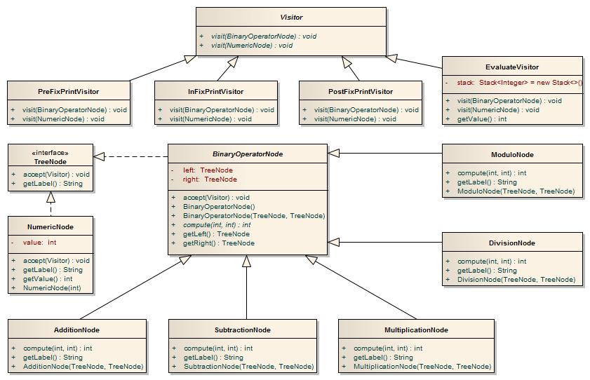
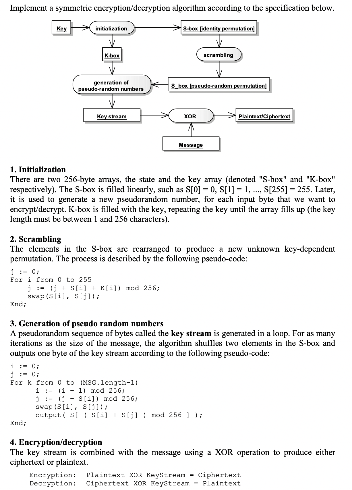

# GoF design patterns 

## Dokumentacja

*   [Implementacje GoF w Javie (zakładka Downloads)](http://www.informit.com/store/java-design-patterns-a-tutorial-9780201485394
    )
*   [Implementacje GoF w JS](http://addyosmani.com/resources/essentialjsdesignpatterns/book/
    )

## I. Composite & Visitor

## Opis zadania

Zapoznać się z implementacją Binary expression tree bez wykorzystania wzorca Visitor, ale z wykorzystaniem wzorca Composite ([Project1-Composite](./Project1-Composite)). Dokończyć implementację operacji inFixPrint() w taki sposób, aby wywołana na korzeniu wydrukowała wyrażenie reprezentowane przez dane drzewo w postaci infix'owej. Następnie przyrostowo (implementacja przyrostowa oznacza, że na danym etapie nie wiemy jakie będą kolejne rozszerzenia) rozszerzyć funkcjonalność drzewa o operacje evaluate(), postFixPrint(), preFixPrint() oraz interpretację nowego operatora - reszta z dzielenia (%). Zastanowić się nad potencjalnymi korzyściami oraz kosztami zastosowania zasady projektowej open/closed. Następnie zaimplementować wersję bazową programu z wykorzystaniem wzorca Visitor. Metodę Parser::parse() zaimplementować tak, aby tworzyła węzły reprezentujące konkretne operacje (np. AdditionNode; patrz diagram poniżej), a nie jak poprzednio ogólne węzły typu BinaryTreeNode. Inkrementalnie dodać funkcjonalność z wersji bez wzorca.  

## Punktacja

*   Rozszerzenie wersji bazowej bez wykorzystania wzorca Visitor
    1.  implementacja operacji inFixPrint() (0,25 pkt)
    2.  implementacja operacji evaluate() (0,25 pkt)
    3.  implementacja operacji postFixPrint() (0,25 pkt)
    4.  implementacja operacji preFixPrint() (0,25 pkt)
    5.  rozszerzenie programu o interpretację operatora % (modulo - reszta z dzielenia) (0,25 pkt)
*   Implementacja Binary expression tree z wykorzystaniem wzorca Visitor
    1.  implementacja wersji bazowej (1 pkt)
    2.  implementacja InFixPrintVisitor (0,25 pkt)
    3.  implementacja EvaluateVisitor (0,5 pkt)
    4.  implementacja PostFixPrintVisitor (0,25 pkt)
    5.  implementacja PreFixPrintVisitor (0,25 pkt)
    6.  rozszerzenie programu o interpretację operatora % (modulo - reszta z dzielenia) (0,5 pkt)

## II. Decorator

## Opis zadania

Przygotować implementację algorytmu prostej [kompresji/dekompresji](http://www.codeproject.com/Articles/223610/A-Simple-String-Compression-Algorithm) oraz algorytmu [symetrycznego szyfru strumieniowego](./cipher.pdf). Wykorzystując wzorzec Dekoratora zaimplementować klasy `PackerOutputStream, UnpackerInputStream, CipherInputStream, CipherOutputStream`.  
Klasy `CipherInputStream` oraz `CipherOutputStream` powinny używać identycznego klucza domyślnego jeśli klucz nie zostanie przekazany w konstruktorze.  
Klasy `java.io.FilterOutputStream` oraz `java.io.FilterInputStream` pełnią rolę dekoratorów i trzymają referencję na fizyczny strumień, który pełni rolę komponentu (patrz diagram z wykładu). Z kolei klasy, które mają zostać zaimplementowane pełnią rolę konkretnych dekoratorów.

## Punktacja

*   implementacja i demonstracja CipherOutputStream oraz CipherInputStream (2,5 pkt)
*   implementacja i demonstracja PackerOutputStream oraz UnpackerInputStream (2,5 pkt)
*   demonstracja całości jako jednego strumienia, który pakuje i szyfruje oraz drugiego, który deszyfruje i rozpakowuje (1 pkt)

Warunkiem koniecznym zdobycia punktów jest spełnenie odpowiednich testów JUnit ([Project1-CipherPacker](./Project1-CipherPacker)).

## Algorytm symetrycznego szyfru strumieniowego

