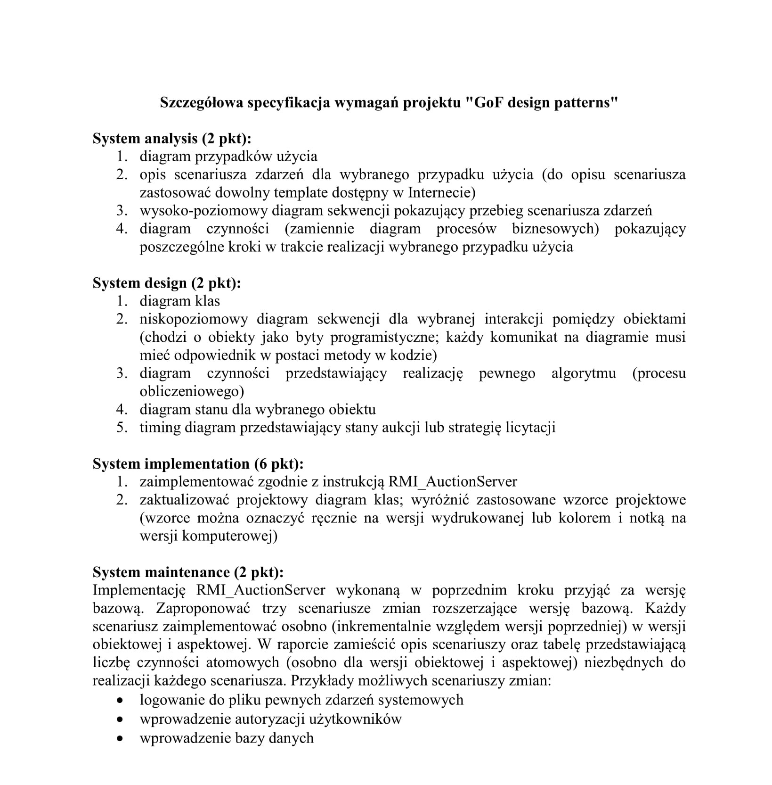

# GoF, RMI, AOP 

## Bob Tarr: CMSC446 Introduction To Design Patterns, 2006

-----------------------------------------------------------

[RMI Auction Server Project](http://userpages.umbc.edu/~tarr/dp/spr06/projects/Project2.html)

-----------------------------------------------------------

* * *

### 

### Project Description

In this project, you will be implementing a simple auction system. The "auction server" and the "auction client" will be implemented using RMI. The server will be used to maintain a list of items available for auction purchase. Clients will be allowed to make bids on available items or put new items up for auction. Clients can also be notified when the current bid on a particular item changes. In addition, the client will be able to specify different automatic bidding strategies.

This application will require that both the client and server have remote objects. The server has a remote object which implements the following interface:

      public interface IAuctionServer extends Remote {
         public void placeItemForBid(String ownerName, String itemName, String itemDesc, double startBid, int auctionTime) throws RemoteException;
         public void bidOnItem(String bidderName, String itemName, double bid) throws RemoteException;
         public Item\[\] getItems() throws RemoteException;
         public void registerListener(IAuctionListener al, String itemName) throws RemoteException
      }

These methods do the following:

*    public void placeItemForBid(String ownerName, String itemName, String itemDesc, double startBid, int auctionTime) 
    
    Puts a new item up for auction by the owner with name ownerName. 
    The itemName argument uniquely identifies the new item to be auctioned. 
    If an item by that name already is up for auction in the server, a RemoteException is thrown. 
    A description of the item is given by the itemDesc argument. The starting (minimum) bid is given by the startBid argument. 
    The item will be available for auction for the number of seconds given by the auctionTime argument.
    
*    public void bidOnItem(String bidderName, String itemName, double bid) 
    
    The bidder with name bidderName makes a new bid on the item specified by the itemName argument. 
    The bid amount is specified by the bid argument. 
    For the bid to be accepted it must be higher than the current bid on the specified item, else a RemoteException is thrown.
    
*    public Item\[\] getItems() 
    
    Returns an array of items available for auction. Each Item object consists of the owner's name, item name, 
    item description, current bid, current bidder's name and time remaining on the auction period for the item.
    
*    public void registerListener(IAuctionListener al, String itemName) 
    
    Registers a listener with the auction server for changes in the item specified by the itemName argument. 
    Whenever the current bid on the specified item changes (or its auction period expires), the IAuctionListener 
    is notified via its update() method. Note that the IAuctionListener object is a remote object!
    

Any client object which desires to be notified of changes in the bid status of a specific item must implement the following interface:

      public interface IAuctionListener extends Remote {
         public void update(Item item) throws RemoteException;
      }

The update() method of this interface does the following:

*    public void update(Item item) 
    
    Invoked by the auction server for each IAuctionListener which has registered to be notified of changes
    in the bid status of the specified item.
    

* * *

### 

### Project Requirements

Use the above interfaces to write a **working** version of the RMI auction server application. Implement both the server and the client programs.

Your project must implement the following design patterns:

*   Observer  
    Each item for auction is an observable object.
*   Abstract Factory  
    Create the server object using a factory.
*   Singleton  
    Allow only one instance of the server object to be instantiated.
*   Strategy  
    Allow your client to use different automatic bidding strategies. Support at least the following strategies:
    *   Have the client specify a maximum bid amount. If anyone outbids the client, automatically bid $1.00 more than the current bid, up to the maximum bid.
    *   Wait until the last minute of the auction period, then bid 100% more than the current bid.

Feel free to use any other patterns you feel appropriate.

You will need some user interface code to allow putting items up for bid, bidding on items, selection of automatic bidding strategies, and registration of listeners. Implement this in GUI.

To make testing simpler, you may have your server object automatically start with some items up for auction. Test your application with at least three auction items, two clients and the server.

Your project code must also be well documented and use a reasonable indentation style. In particular, places where design patterns are implemented should be noted in the code.
    

* * *

### 

### Project Grading

[Szczegółowa specyfikacja wymagań projektowych](./Szczegolowa_specyfikacja_wymagan_projektowych.pdf)

